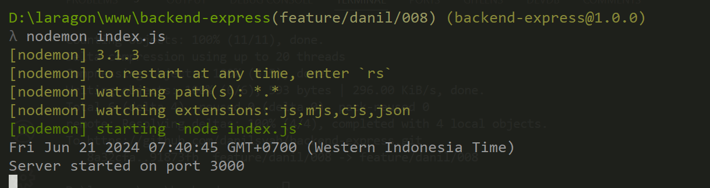

### Restfull API documentation

### Cara menjalankan app 

    1. rename file .env.example to .env
    2. jalankan pada terminal : npm install
    3. install nodemon pada terminal : npm install -g nodemon
    4. run app : nodemon index.js
   

